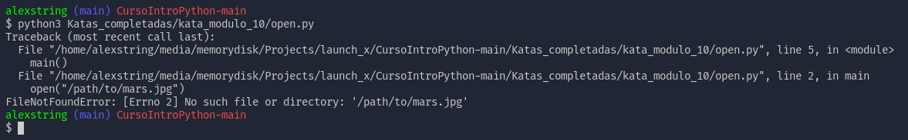
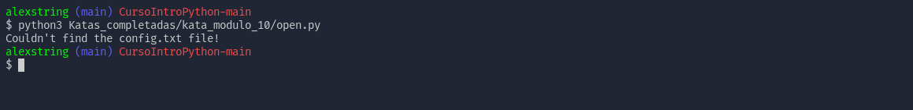
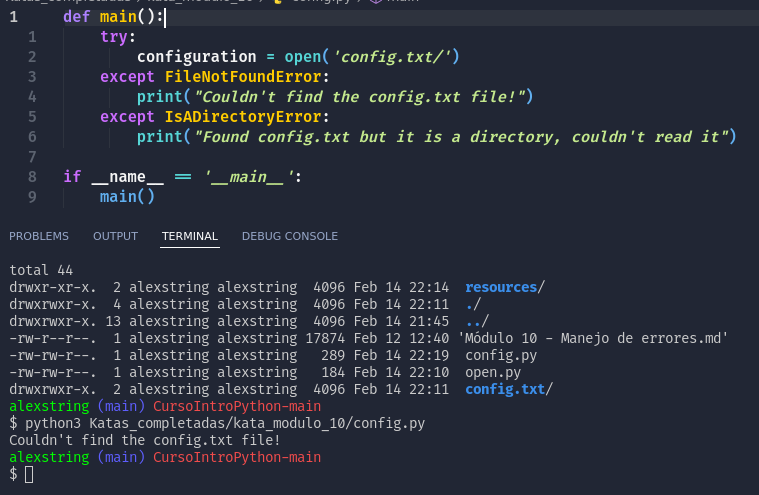
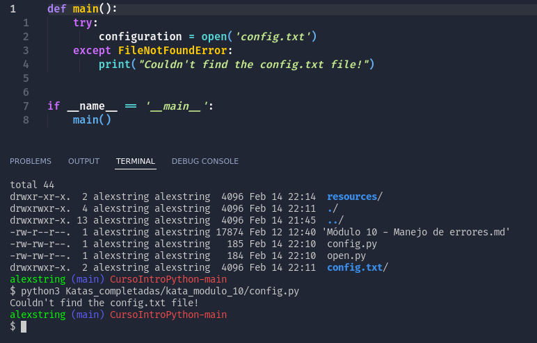
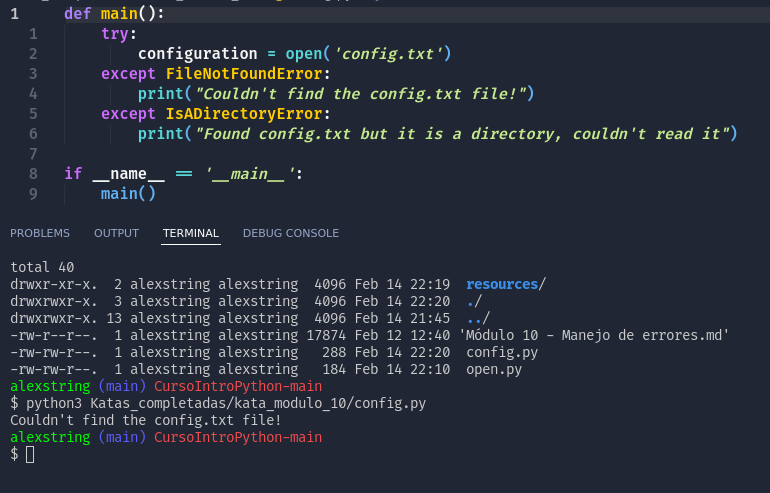
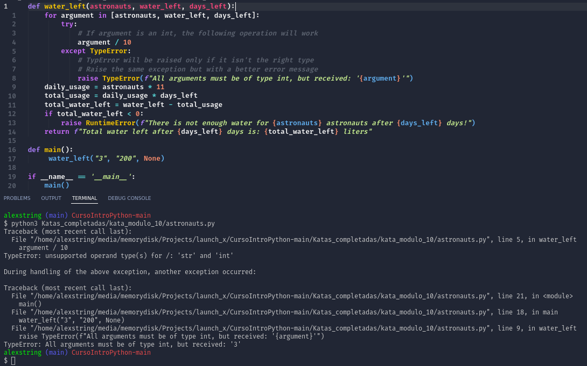

# Bitacora de Kata, Modulo 10
## Datos

Práctica de la Kata elaborada por: 
- [AlexString](https://github.com/AlexString)

Para el curso de:
- [LaunchX-InnovaccionVirtual](https://github.com/LaunchX-InnovaccionVirtual)

## Procedimiento

1. Ejeución de open.py

2. Ejecución de open.py con exception

3. Ejecución de config.py 

*A pesar de que la exception **'IsADirectoryError'** está especificada mi command line prompt no logra entrar a esa excepción y siempre cae en la excepción de **FileNotFoundError**, esto quizás se deba a mi sistema operativo en relación a cómo Linux interpreta los directorios.*

Datos de mi sistema:
- Fedora Linux XFCE 64 bits

4. Ejecución de config.py con solo **FileNotFoundError** especificado.

5. Ejecución de config.py pero está vez se eliminó la carpeta *config.txt*

6. Ejecución código de función del agua de astronautas con exceptions y raise errors

