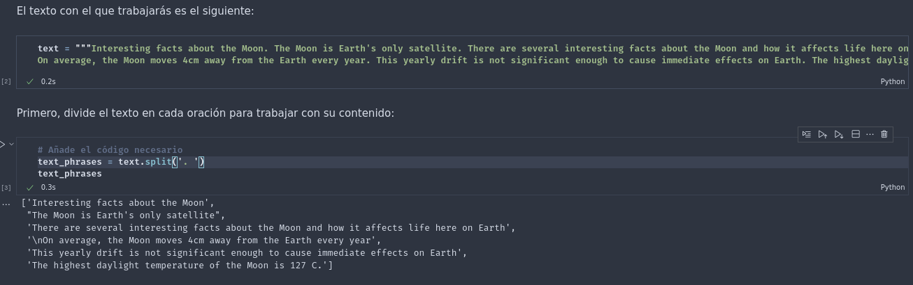
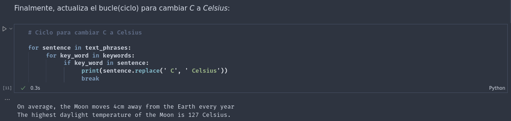
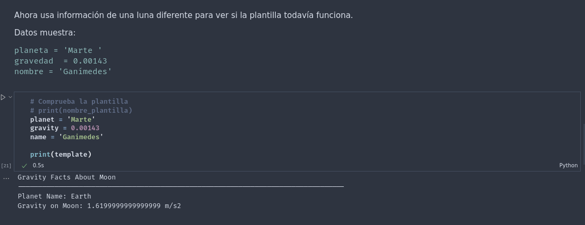
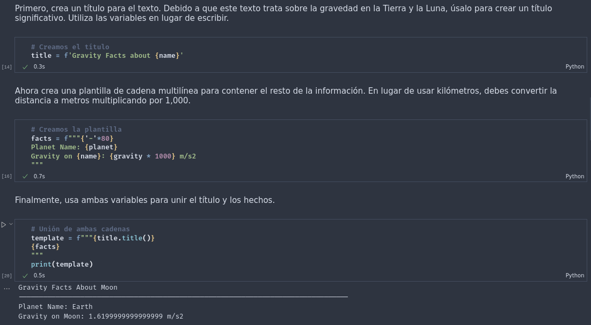

# Bitacora de Kata, Modulo 4
## Datos

Práctica de la Kata elaborada por: 
- [AlexString](https://github.com/AlexString)

Para el curso de:
- [LaunchX-InnovaccionVirtual](https://github.com/LaunchX-InnovaccionVirtual)

## Procedimiento

1. Primer bloque 'text phrase'

2. Segundo bloque 'text replace'

3. Tercer bloque 'planet facts format'

4. Cuarto bloque 'planet facts format'

