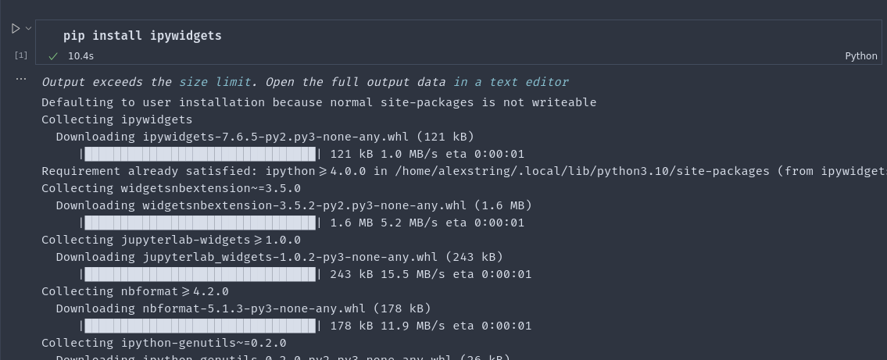
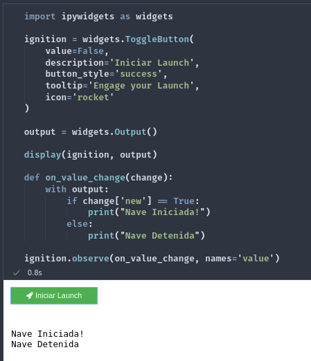
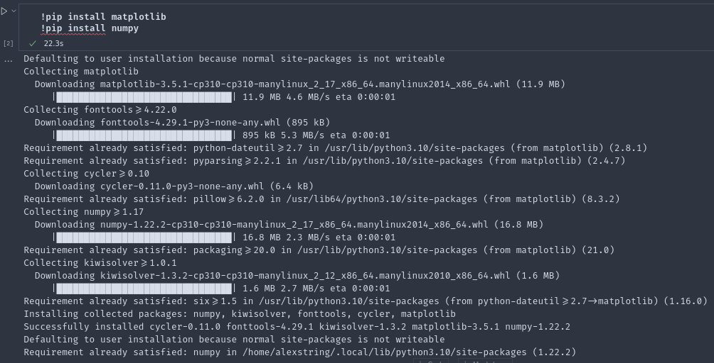
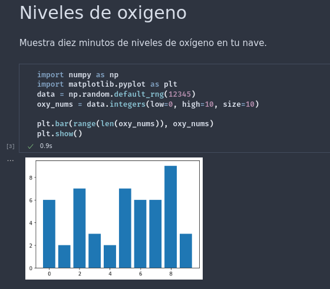

# Bitacora de Kata, Modulo 0
## Datos

Práctica de la Kata elaborada por: 
- [AlexString](https://github.com/AlexString)

Para el curso de:
- [LaunchX-InnovaccionVirtual](https://github.com/LaunchX-InnovaccionVirtual)

## Procedimiento

1.  Instalando ipywidgets

2. Ejecutando bloque de código de ipywidgets

3. Instalando matplotlib y numpy 

4. Ejecutando bloque de código de matplotlib y numpy

# Extra:
Como dato extra, obtuve un bug de renderización por parte de las extensiones de Jupyter Notebook y Jupyter Renderer, siguiendo este post en StackOverflow logré solucionar el error:

https://stackoverflow.com/questions/68736618/error-loading-preloads-could-not-find-renderer

