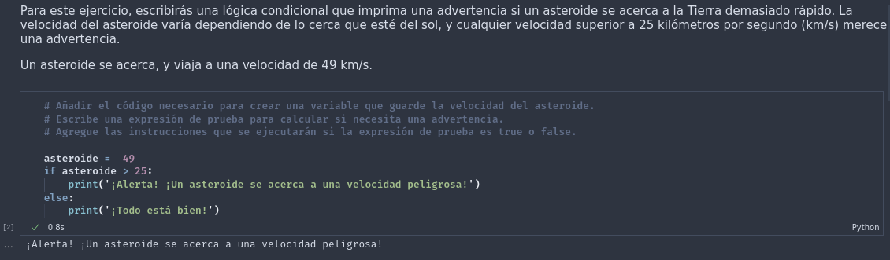
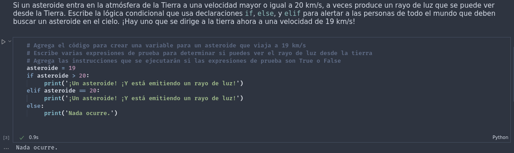
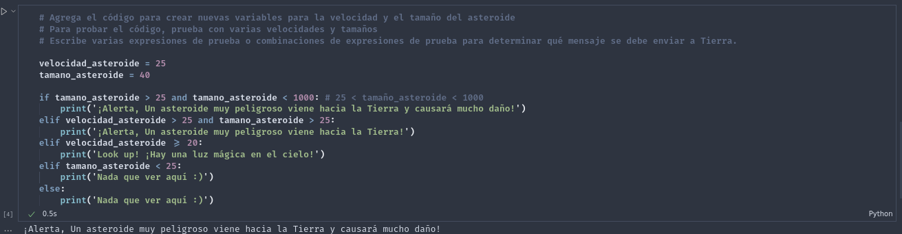

# Bitacora de Kata, Modulo 3
## Datos

Práctica de la Kata elaborada por: 
- [AlexString](https://github.com/AlexString)

Para el curso de:
- [LaunchX-InnovaccionVirtual](https://github.com/LaunchX-InnovaccionVirtual)

## Procedimiento

1. Ejecución del primer bloque de código.

2. Ejecución del segundo bloque de código.

3. Ejecución del tercer bloque de código.

